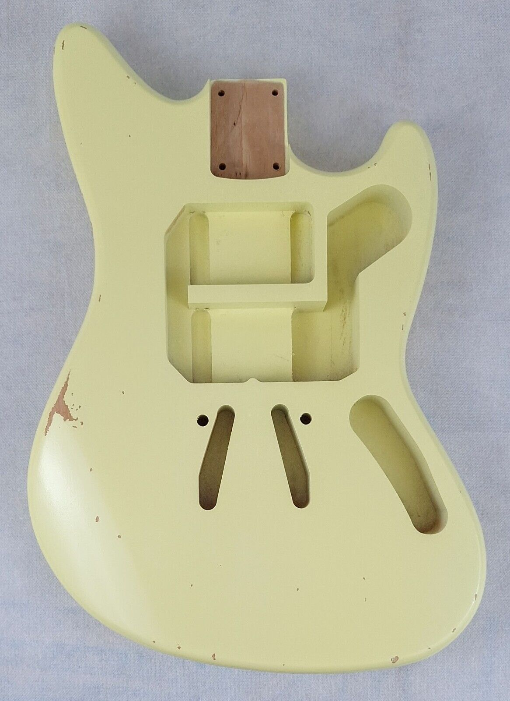
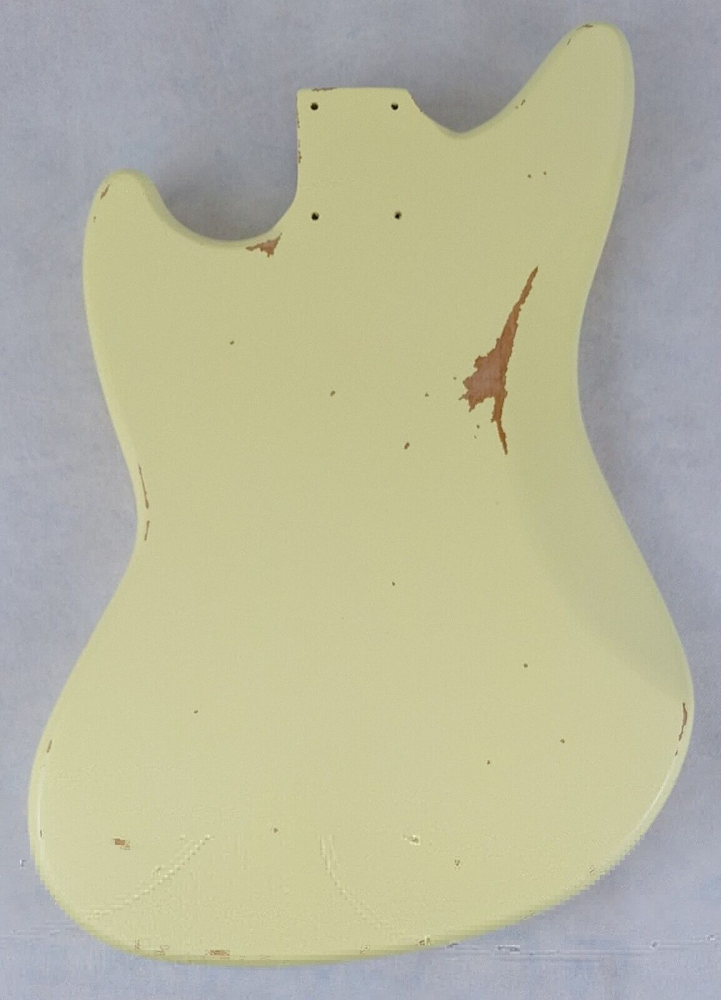
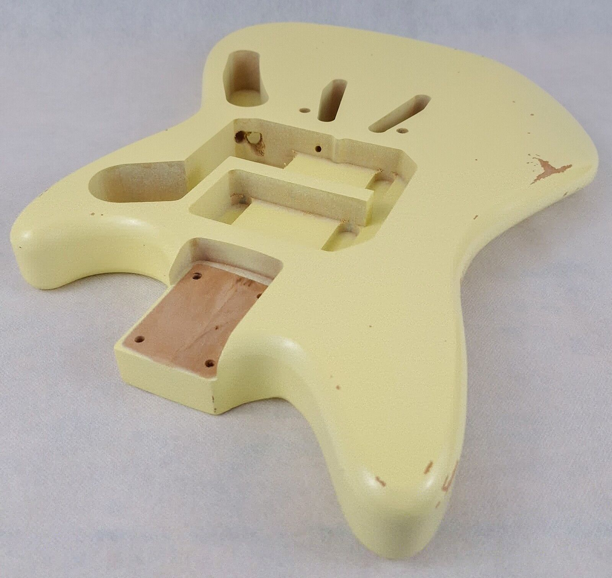
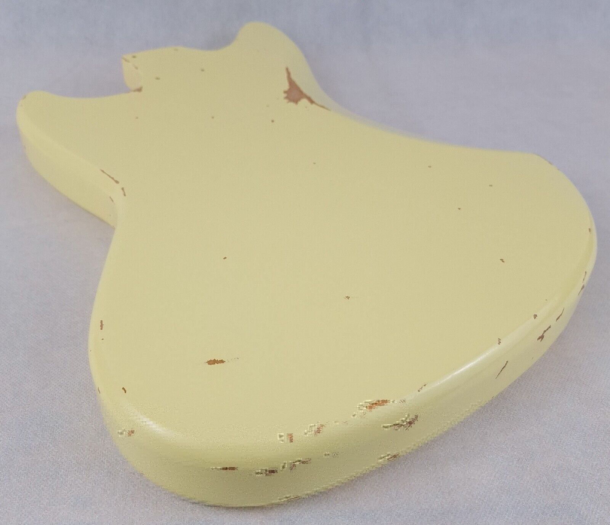

# Franken-Jag-Stang
I bought a guitar body from ebay of a so-called Jag-Stang Prototype: **"Alder JS Prototype Guitar Body, Aged Relic 
Nitro, Fits Jagstang® Mustang® Neck"**

A lot of Jag-Stang owners seem to share my interest in 'completing' the unfinished guitar design. We are without 
closure on this matter. Some people have designed bodies and are selling templates for you to create your own, 
others like Rosser Guitars are producing the bodies for sale on ebay!

This is the one I bought, I plan on using parts from my _actual_ Jag-Stang, and I'll take the opportunity to swap 
some of the components:

