# Keyboard Progress

This is a prototype of my custom keyboard, the Katana. What you see here is two 3D printed plastic plates, with a cardboard structure. The layout is symmetrical, with a rotation to accommodate the natural shape of the human (read: my) hand, and the center is tilted upwards for both plates.

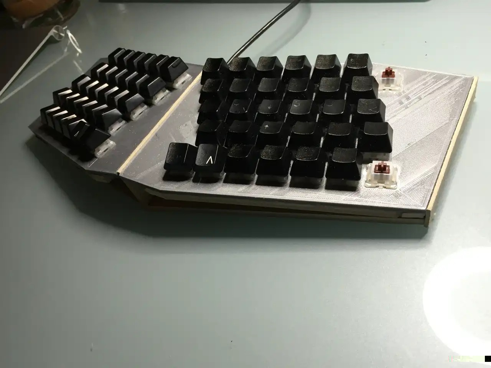
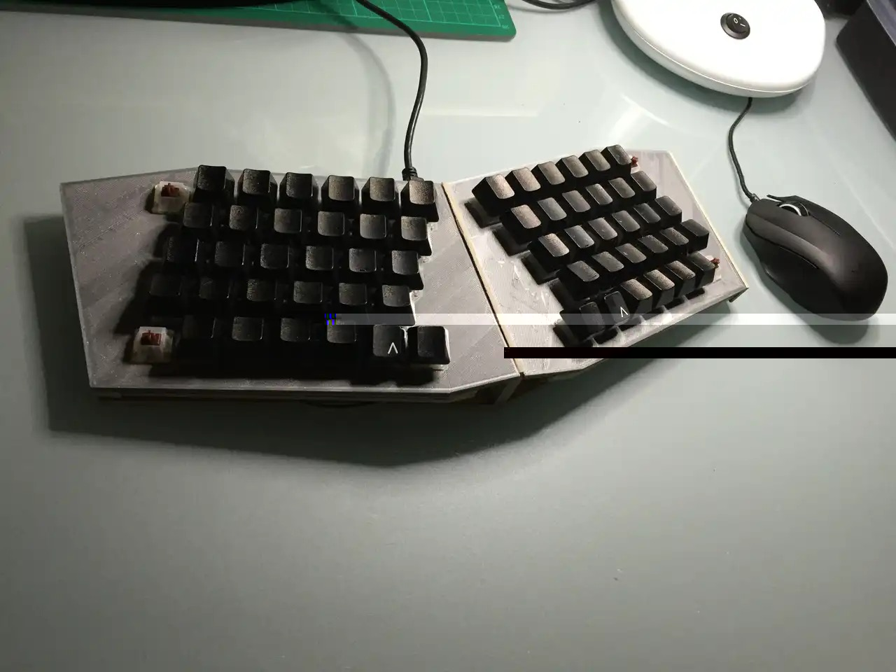

My main motivation is to create a better MSNE4K (Microsoft Natural Ergonomic Keyboard 4000). Many of the angles chosen were based on the shape of this keyboard.

This is an early protoype, constructed out of cardboard.

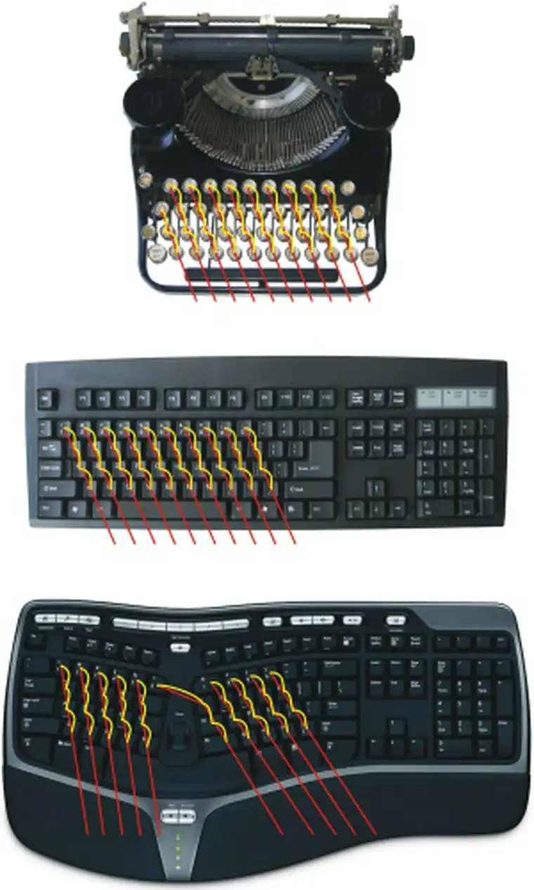
This picture, from www.trulyergonomic.com, illustrates why I believe a symmetrical layout is an ergonomically better design choice.

I could have opted for an ortholinear grid layout (as well as the rotation) but I'm very pleased with the right hand layout of the MSNE4K, and my goal was to 'fix' the left hand reverse stagger - a major design flaw in commercial keyboards in my opinion.

This idea was based on the textblade, which borrows ideas from the spacefn layout. This is still a work in progress - though I've got two psuedo-spacefn layers working...

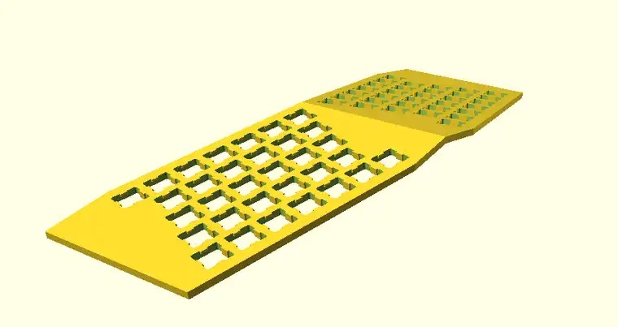
Design a plate using openscad. This is for an initial 3D printed prototype.

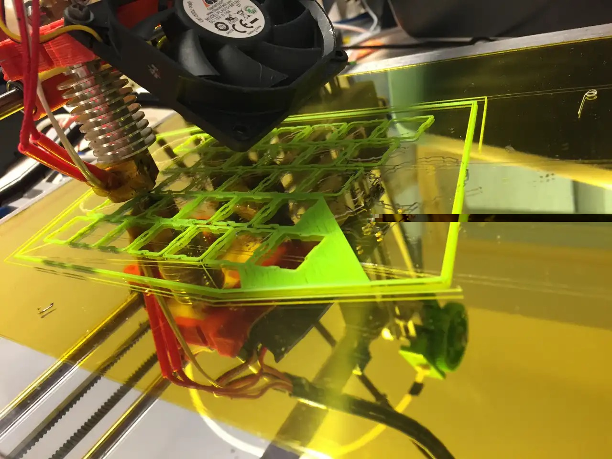
3D printers make this whole process possible. And damned easy.

The finished plate, plain and simple

With switches and keys. Still a few things that need tweaking.

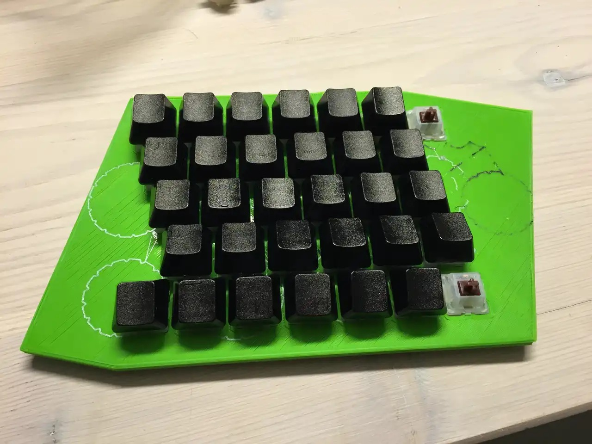
Used a permanent marker to blank the keys out.

Just wanted to check how it types. The MSNE4K keyboard, with mechanical switches - what's not to like?

Looks great, but doesn't work yet.

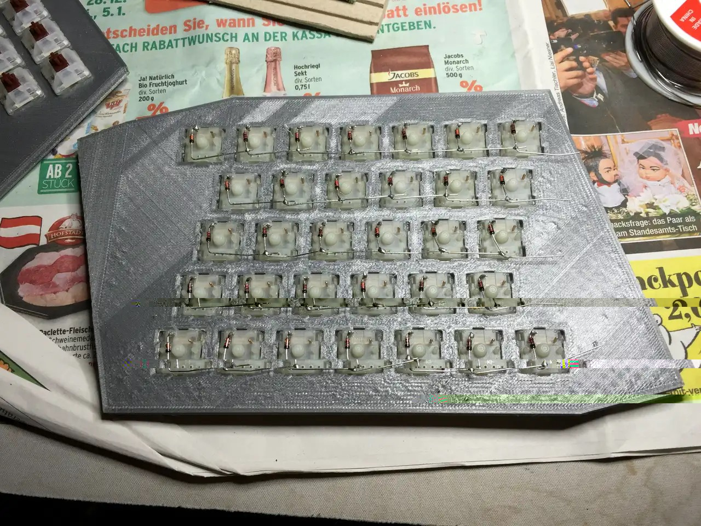
Somebody actually has to wire this thing up before it works. Doh!

That took ages. Need a tea break before starting the opposite side.

Simple cardboard stand that accommodates the microcontroller and raises the plates.

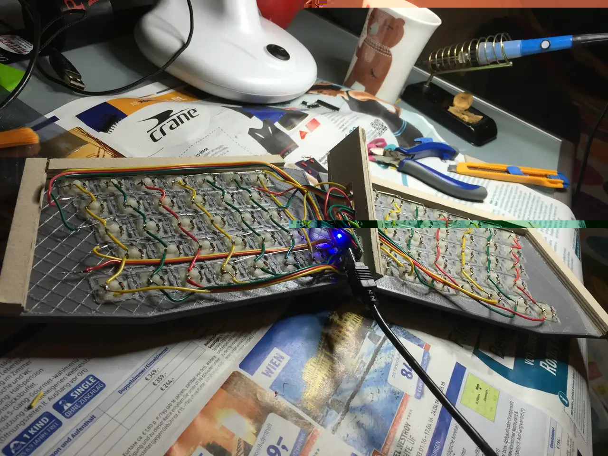
I just need to get the firmware side working. Pushing reset once its all cased up will be hard, so getting a reset button on a function layer is a must.

A big thanks to the many people on the #mechboards irc channel, particularly j`ey, for support during that process.

Aaaaand ready to play!

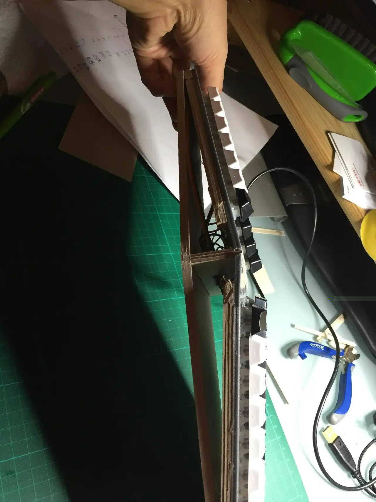
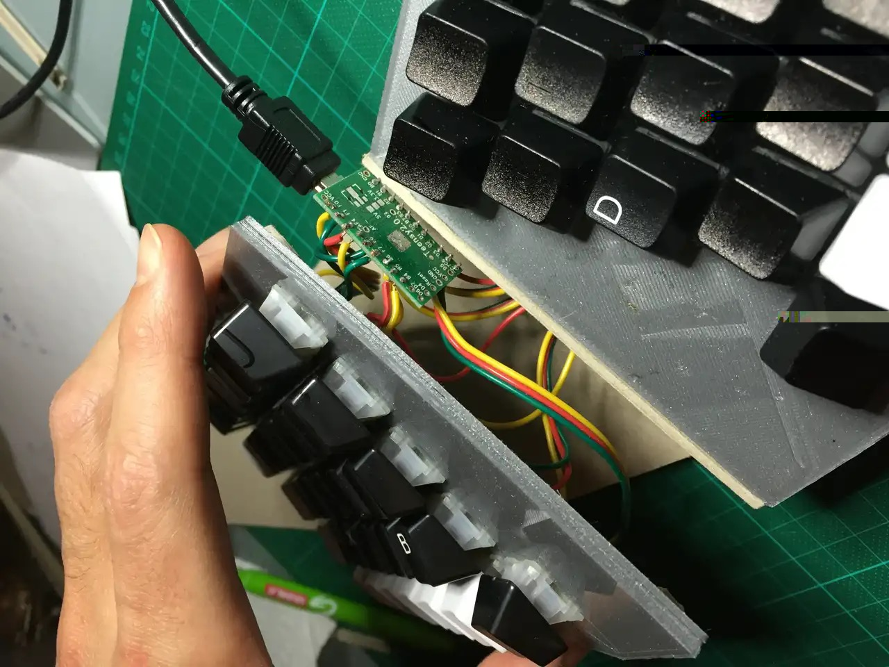
Its a little messy, but it's just a prototype...

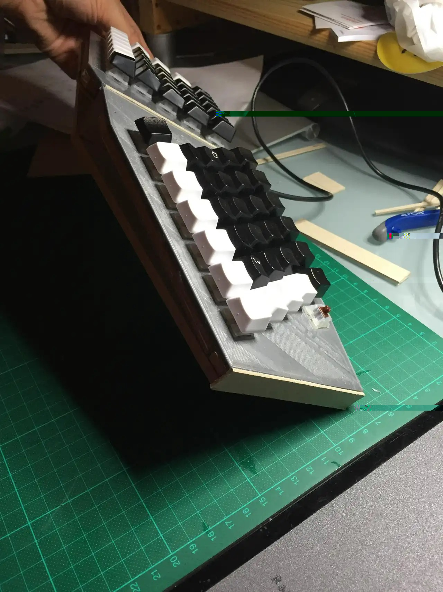

I'd like to work on the aesthetics before printing a final top plate (and encasing), but I figure I could make a big aesthetic improvement just by resizing some of the outer keys.

I also need (really badly want) to make a wrist rest for the keyboard, as I can't keep using kiwis.

I'd also like to build PCBs, and even explore the suggestion of making it foldable - that's entirely possible right now, but I'd need to improve the durability of the encasing.

