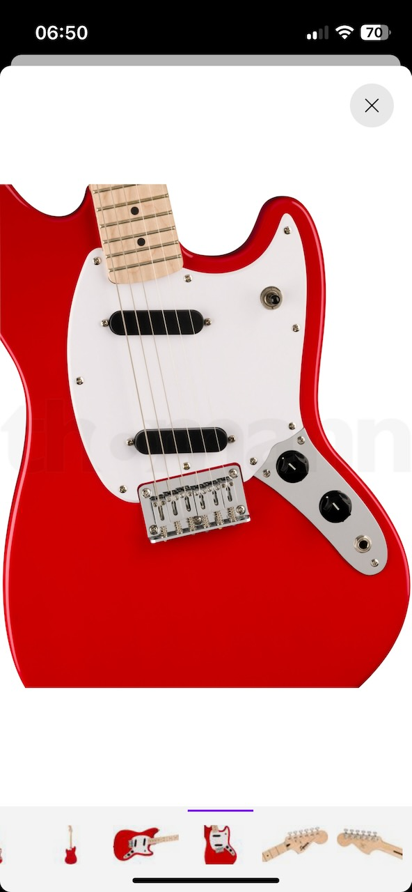
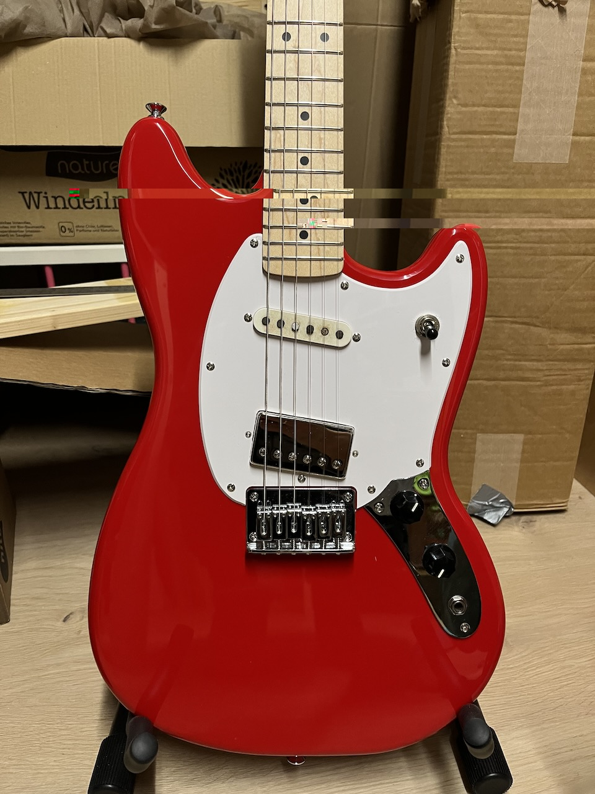
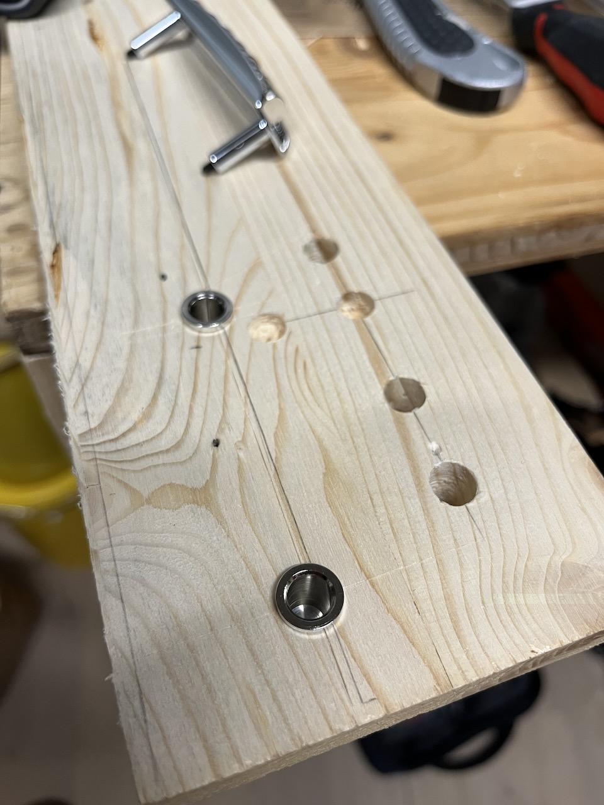
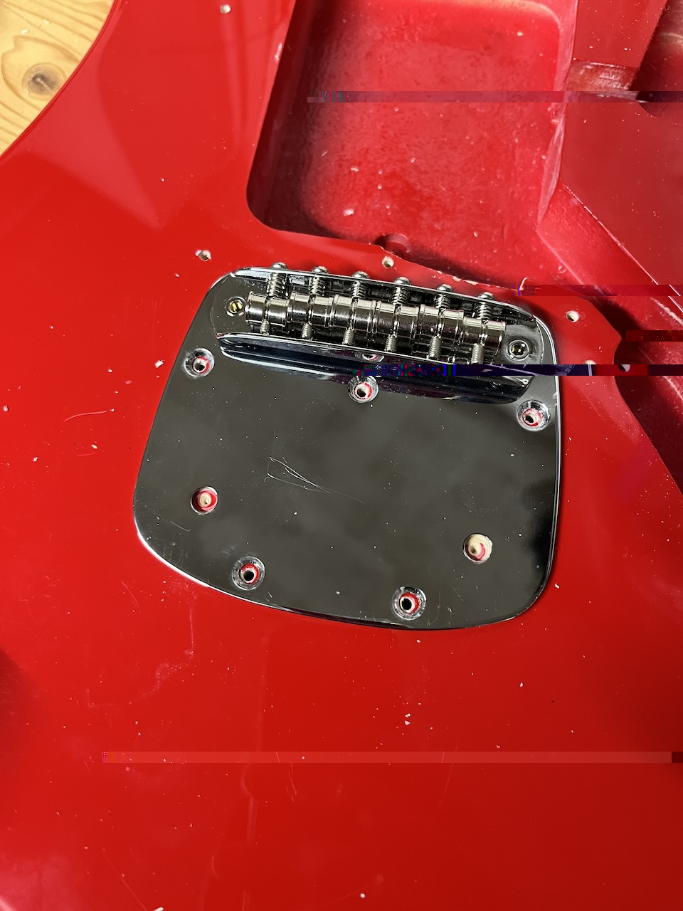
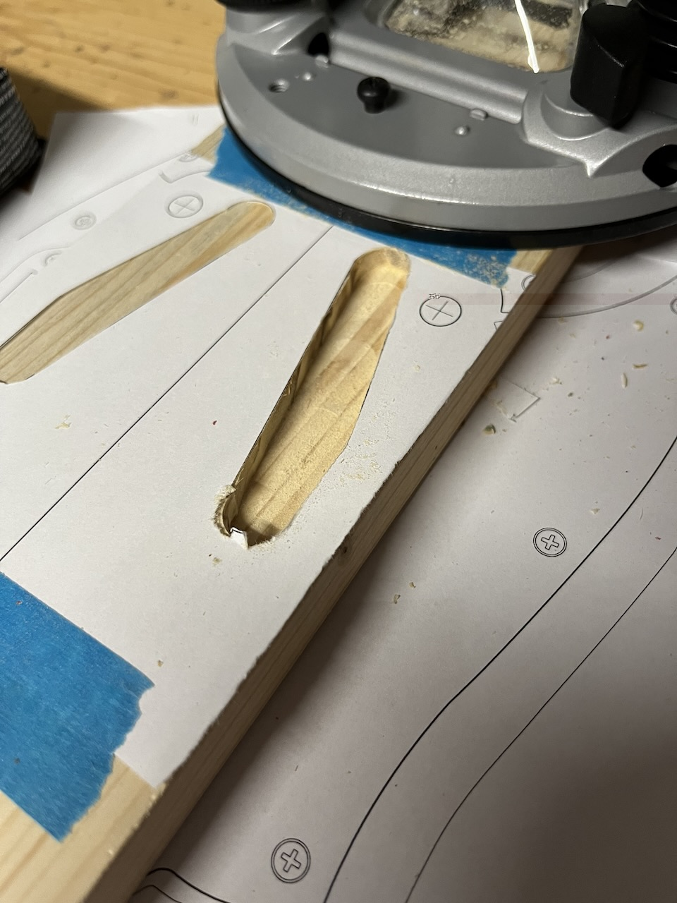
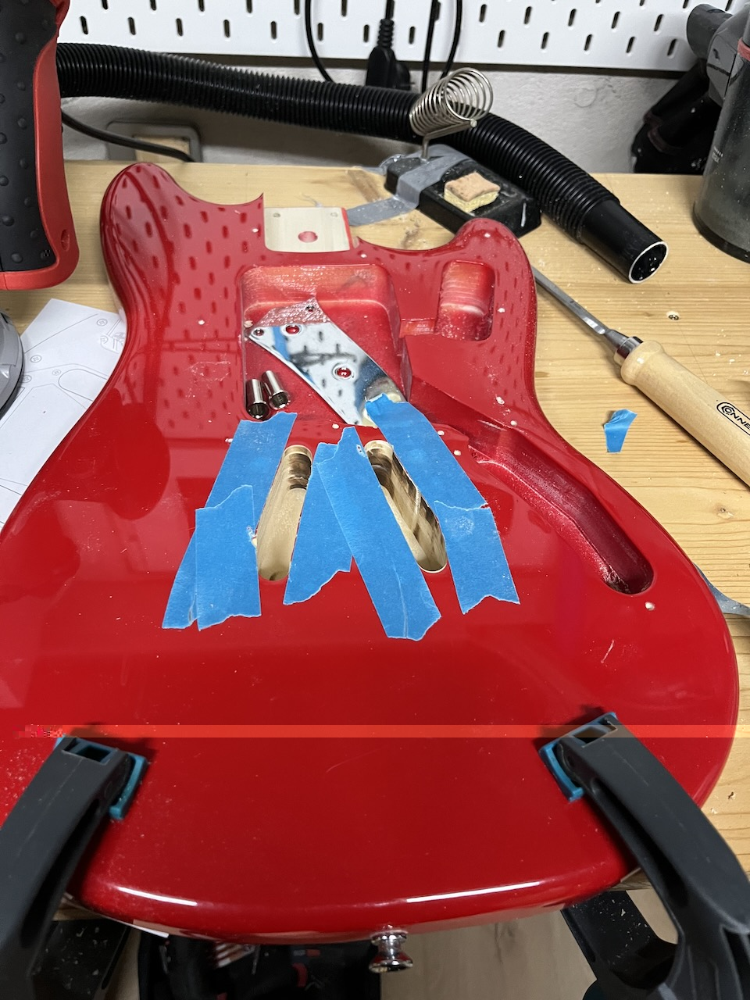
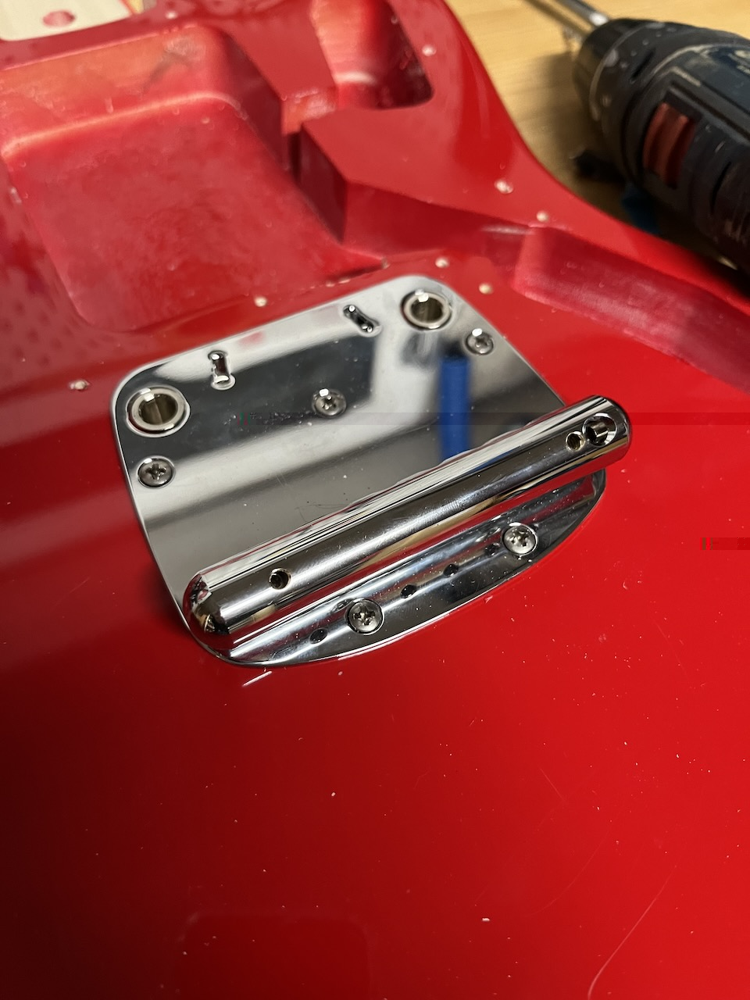
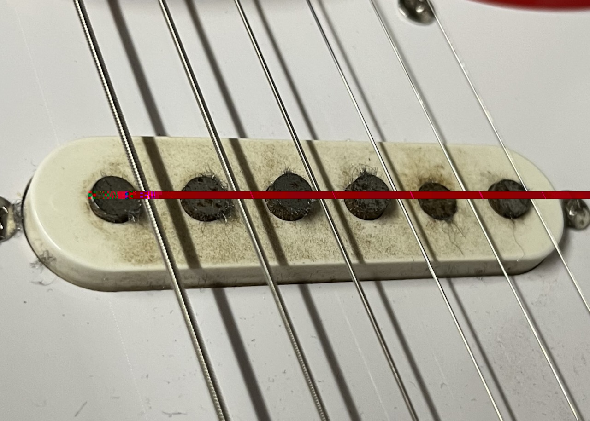
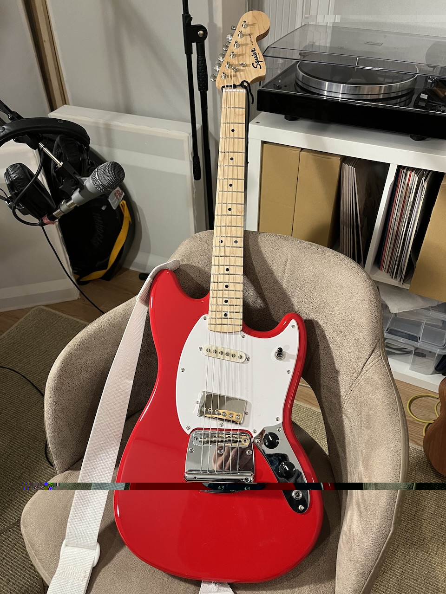
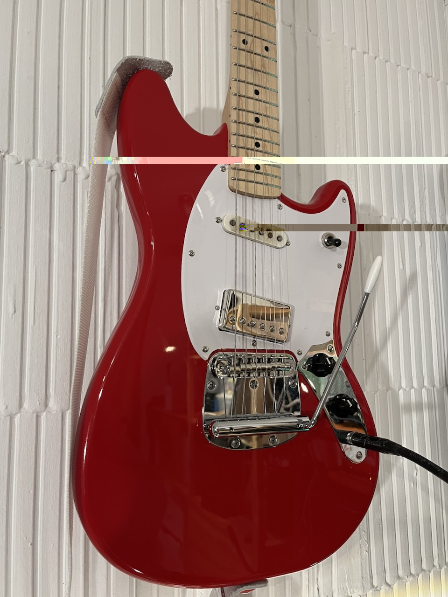

## Squier Sonic Mustang - Dynamic Vibrato bridge and tail piece mod.

TLDR: I routed the body of my Squier Sonic Mustang and fitted a [Mustang Tremolo Tailpiece](https://warmoth.com/mt1c) from [Warmoth](https://warmoth.com/)

I initially bought this Sonic Mustang because I wanted a cheap maple neck that was compatible with my Bullet Mustang and
my Jag-Stang, after this mod I've fallen in love with the guitar!

I've had a thing for maple necks for a while, which is alright if you're a Fender Tele or Strat kinda player, but I
like the shorter scale (24") Mustang guitars from Fender and Squier, and those guitars simply don't have ready made
maple necks for sale - you have to get a custom one made.

So when the Sonic Mustang range was announced, I was immediately drawn to this model. The attractive 160 Euro price tag
compares favourably against the 300 odd cost of a custom neck, plus you get a guitar with it, and less risk of buyers'
remorse ;)

Here's a close up of the guitar before the bridge mod, at this stage I had already swapped the pickups:
- a Roswell LAF in the bridge position - not to be underestimated, the most satisfied I've been with a humbucker, and my other guitar has a JB
- this is the original neck pickup from my Jag-Stang, that pickup has travelled far and wide, maybe I'll tell that story in a post one day

Honestly, this pickup combo is my favourite after years of looking for good balance between neck and bridge positions. 

## Bridge posts

I ordered the bridge and thimbles from a European seller called [Custom Guitar World Parts](https://www.customworldguitarparts.com/),
and got started with my test fits. My original plan was to route the bridge post holes with a plunge router, but the
advice I got from the luthier community was to use a drill press - which I didn't have, nor did I have the time to find
one.

I already had the Warmoth Mustang Tremolo Tailpiece on a shelf - I originally ordered it just to get the tremolo arm!

I tried drilling the holes manually with my drill driver - I was satisfied with the results, so I decided to go with
that approach (this is a cheap guitar, and part of the hobby is to learn how to do such things, so I didn't get caught
up in the weeds of what's the absolute best way to do X or Y).

Here are the holes in the actual body, the hole on the right was my first one, and I was really careful to get it
straight down. The second hole on the left went at a *slight* angle, I definitely rushed it - I was excited after having
done such a good job with the first one :)

To compensate, I worked the drill to correct the angle, I took care not to move the opening (which can very easily
happen if you don't hold the drill with a firm grip). The thimble is not 100% perpendicular, but it doesn't need to be -
string tension will keep it from moving (spoiler alert: the guitar is stable after this mod).

*A small note about accuracy: I took care to drill straight down at the points I measured for the bridge posts, but there
is some room for error - the bridge and guitar will still work if you are a little bit off. If you are worried however, 
I would recommend spending more time on the testing phase than I did - I have a steady hand and am no beginner with
woodwork (I'm far from a pro as well).*

*Additionally, I used a Brad point bit, to guide the bit down into the body, (and for the first hole) checking my angles
regularly, not pushing the drill, but letting it do the work.*

*Another point on accuracy - the posts were 8.8 mm in diameter, and I used a 9mm bit 0.2 mm*

## Alignment and routing

You can see my markings of the center line between the original bridge screws.

I wanted to see how it would look with the chrome plate in place, so I drilled some holes accommodate the spring hooks.

A closer picture. With the plate in place, I took note of the angle and drilled holes for the screws, using a dremel to make pilot holes first.

On a side note: I wish I took more pictures of the process, but I hadn't planned on writing this post at the time!

## Routing the spring channels

I printed [this template](../../media/2024/02/MUSTANG.pdf) twice to scale - I found it over at [GitarreBassBau.de](https://www.gitarrebassbau.de/viewtopic.php?t=6#p18566).
I cut and taped one piece on to my test board and went to work with my router (for the first time - I bought it for this
project in particular, although I expect I'll be doing more guitar related woodwork, so I'll get value out of it)...

I was **really** happy with the early result, so much so that I basically jumped straight in to routing the actual body.

With more time (and patience), and certainly if I were doing this more often, I would prepare a template to guide the
router.

As I was excitable and impatient, I did the first 2-3 passes by hand-eye coordination alone (all those year of
playing video games have certainly proved useful in my adult life).

After 2-3 passes, I had enough depth for the flush trim bit to catch, the remaining passes were over pretty quickly.

Another item for list of things I would do differently: buy a workshop hoover - I connect my handheld Bosch hoover to
the router, which worked very well, but I'm pretty sure I've killed the filters in doing so!

### Body width, channel depth, risk assessment
Just a note for those considering this mod for their own Squier guitars: As long as the body width is deeper than the
spring assembly depth, you should have enough space for the procedure.

The risk is *not* that you will somehow accidentally go too deep and bore a hole on the other side - any decent router
will have very precise depth control.

There is a risk of creating a hole if you knock the guitar on the reverse side in the exact place where the channels are.
Rather than a dent in the finish, you might get a hole instead.

For me, I think the risk is small, and the consequence of such a hole is also insignificant (because it's on the reverse
side, of course) - also, I definitely believe that knocks and dinks add character, and don't try to avoid them too much
(as evidenced by some of these pictures!). If that resonates with you then don't hesitate: just do it...

But do make sure you measure up carefully!

## Wrapping up

There it is, after all the effort. I am VERY pleased with the result, all that remains now is to slot in the bridge,
string it up and play it...

Well, first I had to drill a hole for the ground wire, in this case I soldered it directly to one of the springs. I'm
sure there is a better way, but that is for another day...

A close up of that neck pickup - this is from my Jag-Stang, which is over 20 years old (I can't remember exactly how
old). This was the state it was in after tumbling around in various spares boxes for a few of years. I have now removed
all the metal filings (with tape).

The pickup sounds excellent! I want to get another one for my Franken-Jag-Stang build, but annoyingly, Fender doesn't
document the pickup from that model very well, the best guess is that it's a 'vintage strat' pickup, which is as helpful
as asking a chef for pasta (Fender sells three different 'pure vintage' sets and three 'vintage-style' sets for Strats). 

The final look is CLEAN. I've always liked the look and sound of the Fender Dynamic Vibrato and bridge assembly, but I
think I prefer the Warmoth Mustang Tremolo Tailpiece, the lack of the branding, that wide mirrored surface - it looks 
*so clean*.

## Final thoughts

A few weeks prior to modding this guitar, I reversed the hard tail mod I had had done on my Jag-Stang, because I wanted
to have a working vibrato on it.

It took me a long time to get that tailpiece and bridge working and stable, this guitar however is even *more* stable.
I can really work that vibrato and it returns to tune every single time. The fact that I installed it myself just adds
to the feeling of elation that that gives me!

The family picture, more on these guitars in future posts.

Thanks to anyone who made it this far!

