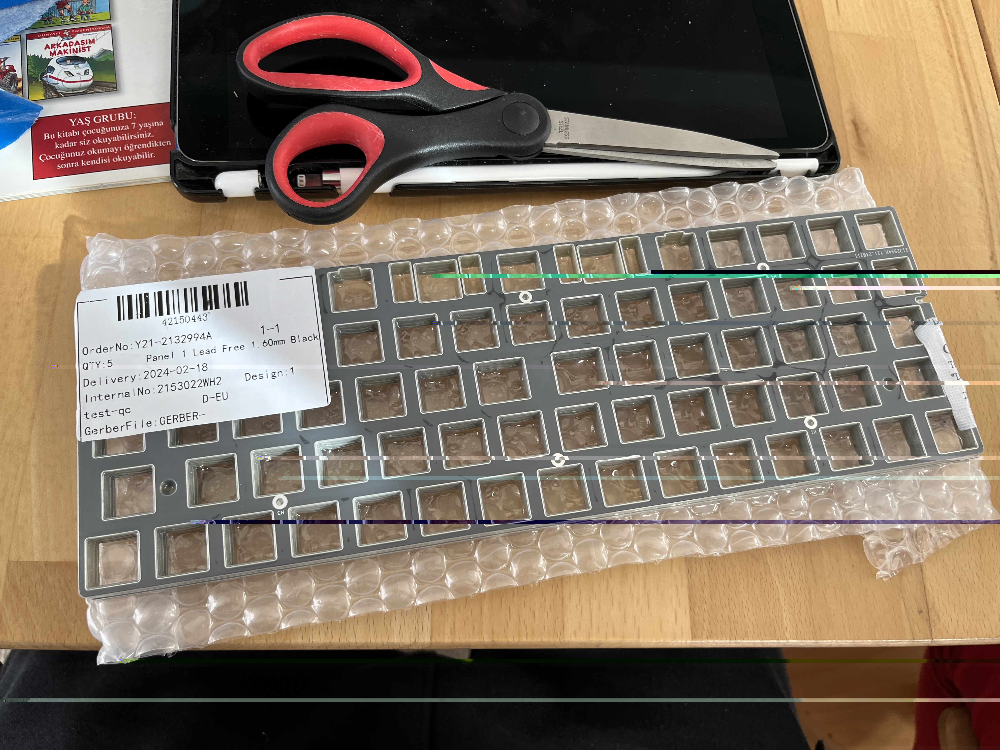

## FR4 Plates

It has become more common to use FR4 plates for mechanical keyboards. According to Wikipedia:
> FR-4 is a composite material composed of woven fiberglass cloth with an epoxy resin binder that is flame resistant
> (self-extinguishing).

Interesting? Maybe. What IS interesting is the price - it is far cheaper than steel or aluminium plates, especially
when you're buying in bulk. I think the black option works really well with keyboards too - making the gaps between 
keycaps extra dark (which I think is a very nice look).

## Katana60 Pro update
All well and good, but what does this all mean for the Katana60 Pro and the Tsuka60 Pro?

I have now prototyped the main PCBs and one of the switch plates. I have ironed out some kinks in the PCB designs, and
I would ideally get another prototype each of those. The plates were simple so I don't think it's necessary to
re-prototype those.

With a final design (which will take as long as a protoytpe will take to manufacture and deliver), the only remaining
step is to decide who is going to foot the bill. Here is where it gets less clear.

CandyKeys - the regular sponsor for production until now - is unable to support the project at this time. This leaves
me with the following options:
1. Foot the production bill myself
2. Run a group buy
3. Find another sponsor

Thankfully, option 3 is looking positive right now - I wasn't expecting that to be the case. Hopefully if that works
out, we can get the PCBs produced fairly quickly, maybe in time for Summer. 
Failing that, I could see option 2 being a regular thing: I'm thinking small batch productions on an annual basis.

I don't see option 1 as likely, I just have too many bills to pay right now for it to be viable!

I have a busy few weeks ahead, I probably won't be able to order those prototypes until mid-March at the earliest.
Until then, here are some more pictures:

